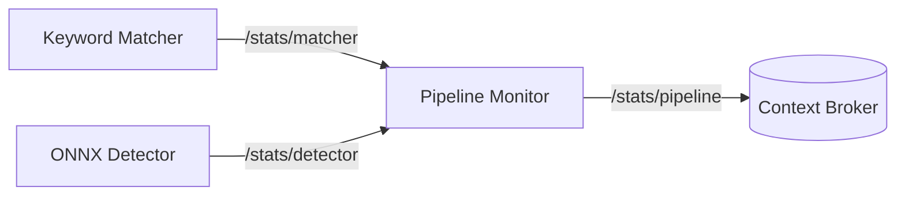
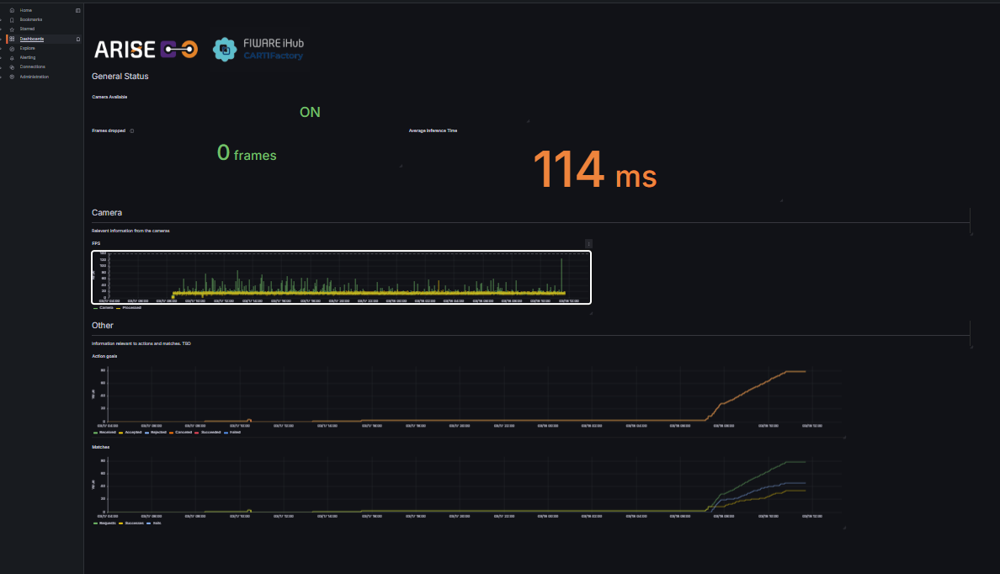

<p align="center">

  <!-- ---------- TOP IMAGE ---------- -->
  <a href="https://www.cartif.es/en/human-robot-collaboration-pilot-plant-cartifactory/">
    
  </a>
  <!-- ---------- CARTIF logo ---------- -->
  <a href="https://www.cartif.es/en/home/">
    
  </a>

</p>

<!-- <p align="center">
  <!-- ---------- ARISE logo ---------- -->
  <!-- Light mode -->
  <a href="https://arise-middleware.eu/">
    
  </a>
  <!-- Dark mode -->
  <a href="https://arise-middleware.eu/">
    
  </a>
</p> -->

<p align="center">
<!-- ---------- ARISE logo ---------- -->
<!-- Light mode -->
[](https://arise-middleware.eu/)
<!-- Dark mode -->
[](https://arise-middleware.eu/)

</p>

<p align="center">
  These 
  Modules are part of the ARISE Middleware<br>
  <a href="https://arise-middleware.eu/">ARISE Middleware site</a>
</p>

<hr>


[](https://github.com/eProsima/vulcanexus)
[](https://releases.ubuntu.com/24.04/)
[](https://github.com/FIWARE/context.Orion-LD/releases/tag/1.10.0)


# General Overview
[ARISE](https://arise-middleware.eu/) aims towards making industrial HRI more accessible and cost-effective, in particular in healthcare, intra-logistics and manufacturing sectors. 
Each of the 4 Testing and Experimental Facilities that are part of the project gives reusable modules to serve as examples of implementations of the ARISE Middleware:
- CARTIF Technology Centre: [**CARTIFactory**](https://github.com/Fundacion-CARTIF/CARTIFactory) (You are currently here!📍😃)
- Intellimech: []()
- PAL Robotics: []()
- Politecnico di Milano: []()

These modules hope to present an integration between [FIWARE Orion Context Broker](https://fiware-orion.readthedocs.io/en/master/) and [eProsima Vulcanexus](https://vulcanexus.org/) to enable context-aware robotic and industrial applications, alongside [ROS4HRI](https://ros4hri.github.io/) as an open-source ROS standard and a set of ROS packages to facilitate the development of Human-Robot Interaction (HRI) capabilities on robots.


## Features
- Automatic CPU / CUDA support
- Segmentation support (OBB from mask)
- Optional annotated image publishing
- Latched `class_map` publishing
- Industrial metrics (FPS, infer_ms, device, etc.)
- Configurable `class_id` mode

## Table of Contents
- [Getting Started](#getting-started)
  - [Dependencies](#dependencies)
- [What is Included in the Module](#what-is-included-in-the-module)
  - [Keyword Matcher](#keyword-matcher)
  - [ONNX Detector](#onnx-detector)
  - [Pipeline Monitor](#pipeline-monitor)
- [Custom Interfaces](#custom-interfaces)
  - [Pipeline Statistics](#pipeline-statistics)
  - [Detection Action](#detection-action)
- [Defining the Models](#defining-the-models)
- [Connecting to FIWARE's Context Broker](#connecting-to-fiwares-context-broker)
  - [Grafana Connection](#grafana-connection)
- [Running the Module](#running-the-module)

# Getting started

This module represents par an AI assitant detection system. The user is expected to input a request and through Natural Language Processing, detect the task and object it is refering too. The object will become the `keyword`, or target object for the module.

<p align="left">
  <!-- ---------- REUSABLE MODULE DIAGRAM ---------- -->
  <!-- Light mode -->
  

  <!-- Dark mode -->
  

</p>

## Dependencies

All Python dependencies are included inside the `requirements.txt` file. To install, execute on terminal:

```bash
pip install -r /requirements.txt
```

This package is dependent on other ROS2 interfaces:
``` bash
sudo apt install \
  ros-${ROS_DISTRO}-vision-msgs \
  ros-${ROS_DISTRO}-cv-bridge
```

# What is included in the module
We provide the **CARTIFactory** package, home to several nodes, that together allow you to test this reusable module.

## Keyword Matcher


The keyword_matcher downstream of the detector node. Its main purpose is to determine whether a requested object class is present in the latest detections.

The node subscribes to the latest detection results and stores them internally. When a match request is received through the `custom_interfaces/MatchAction` action server, it compares the requested keyword against the detected class labels and returns only the detections that match that keyword. Matching can be configured to be case-insensitive, to stop at the first valid match, and to ignore detections below a configurable confidence threshold.

The node additionally monitors the availability of the camera stream by tracking incoming `CameraInfo` messages. If no camera information is received for a configurable timeout period, the node marks the camera as unavailable and rejects incoming match action goals. This allows the node to prevent match requests from being accepted when the perception pipeline is not receiving live input.

## ONNX Detector
The `detector_onnx` node performs image-based object detection and segmentation inference in ROS2 using an ONNX model executed with ONNX Runtime. It subscribes to a camera image topic, preprocesses each frame to the network input size, runs inference, post-processes the model outputs, and publishes the results as `vision_msgs/Detection2DArray`.

The node also supports optional publication of a debug image where masks, bounding boxes, labels, and oriented boxes are drawn on top of the original image. It publishes a latched class map topic so that downstream nodes can resolve class IDs to human-readable labels, either from a TOML configuration file or from fallback numeric IDs.

Configuration can be provided through ROS2 parameters and optionally complemented with a `.toml` file, which may define metadata such as model type, class names, default confidence threshold, and model path. The node supports execution on CPU or CUDA, depending on the selected device and available ONNX Runtime providers.

For monitoring and integration into production pipelines, the node can also publish pipeline statistics such as dropped frames and node identity. It includes an optional `drop_if_busy` mode to avoid queue buildup by discarding incoming frames when inference is still running on the previous one.

Overall, this node is designed as a ROS2 perception component for real-time industrial vision pipelines, combining ONNX inference, mask-based oriented detections, debug visualization, class mapping, and runtime statistics in a single detector node.

<details>

<summary>Supported ONNX model format</summary>

The current implementation expects ONNX models that follow a **dense detection output structure**, with optional instance segmentation support.

#### Outputs

The model must provide either:

**Detection only**

- `output[0]`: tensor containing bounding boxes and class scores

**Detection + segmentation**

- `output[0]`: tensor containing bounding boxes, class scores, and mask coefficients
- `output[1]`: tensor containing mask prototypes

#### Expected prediction structure

Each prediction row is expected to encode:

- Bounding boxes in **center-based format**: `(cx, cy, w, h)`
- Per-class confidence scores
- Optional mask coefficients for instance mask reconstruction

If segmentation is enabled, masks are reconstructed internally by combining the mask coefficients with the prototype tensor.

#### Internal postprocessing

The node assumes a dense prediction tensor where each row represents one detection candidate. Postprocessing is handled internally and includes:

- Confidence filtering
- Non-maximum suppression (NMS)
- Optional mask reconstruction
- Optional oriented bounding box (OBB) extraction from masks

If mask outputs are not present, the node automatically operates in detection-only mode.

#### Input preprocessing

Before inference, each image is preprocessed using the following steps:

- Color conversion (`BGR → RGB`)
- Resize or letterbox to match model input size
- Normalization to `[0, 1]`
- Layout conversion to `NCHW`

#### Output

The node publishes:

- `vision_msgs/Detection2DArray`

Optionally, it can also publish a debug image including:

- Bounding boxes
- Segmentation masks
- Oriented bounding boxes (OBB)
- Class labels and scores

#### Model compatibility

This node is compatible with ONNX models that:

- Output bounding boxes and class scores in a unified tensor
- Optionally include mask prototype outputs for instance segmentation
- Use center-based box representation `(cx, cy, w, h)`

>[!WARNING]
>Models that do not follow this structure may require adapting the postprocessing logic.


</details>


## Pipeline Monitor
This node is used for relaying different statistics of the workspace to the Context Broker (see the latest section about [FIWARE's Context Broker](#connecting-to-fiwares-context-broker)). 

This node subscribes to statistics topics being published by the other two nodes and publish it into a joined status message, using the interface `custom_interfaces/PipelineStats`.




# Custom Interfaces

A `custom_interfaces` package is included, to handle the custom message for the pipeline information and the goal


## Pipeline Statistics

For the sending the diagnostics to the Context Broker we use a custom interface `custom_interfaces/PipelineStats` with the followind definition:

| Field                    | Type              | Description                                                                             |
| ------------------------ | ----------------- | --------------------------------------------------------------------------------------- |
| `frames_dropped`         | `uint64`          | Number of frames discarded before processing due to overload or synchronization issues. |
| `action_goals_received`  | `uint64`          | Total number of goals received by the action server.                                    |
| `action_goals_accepted`  | `uint64`          | Number of goals accepted for execution.                                                 |
| `action_goals_rejected`  | `uint64`          | Number of goals rejected by the server.                                                 |
| `action_goals_canceled`  | `uint64`          | Number of goals canceled after acceptance.                                              |
| `action_goals_succeeded` | `uint64`          | Number of goals successfully completed.                                                 |
| `action_goals_failed`    | `uint64`          | Number of goals that finished with failure.                                             |
| `match_requests`         | `uint64`          | Total number of match operations requested.                                             |
| `match_success`          | `uint64`          | Number of successful match operations.                                                  |
| `match_fail`             | `uint64`          | Number of match operations that failed.                                                 |
| `fps_input`              | `float32`         | Frame rate of incoming images.                                                          |
| `fps_processed`          | `float32`         | Frame rate actually processed by the node.                                              |
| `avg_inference_ms`       | `float32`         | Average inference time per frame in milliseconds.                                       |
| `camera_available`       | `bool`            | Indicates whether the camera stream is currently available.                             |
| `node_name`              | `string`          | Name of the node publishing these metrics.                                              |


> [!WARNING]
> If infer_ms > 200 ms, a WARN status is published.


## Detection action
This action allows a client to request a visual search operation using a keyword.
The node performs detection and returns the results along with an annotated image.

### Goal
| Field | Type     | Description                                                        |
| ----- | -------- | ------------------------------------------------------------------ |
| `kw`  | `string` | Keyword describing the object or class to search for in the scene. |

### Result
| Field            | Type                           | Description                                                                 |
| ---------------- | ------------------------------ | --------------------------------------------------------------------------- |
| `action_success` | `bool`                         | Indicates whether the action execution completed successfully.              |
| `match_success`  | `bool`                         | Indicates whether a matching detection was found for the requested keyword. |
| `det`            | `vision_msgs/Detection2DArray` | Array containing the detections generated by the model.                     |
| `img`            | `sensor_msgs/Image`            | Image with the detections annotated for visualization or debugging.         |

### Feedback
| Field      | Type     | Description                                                                  |
| ---------- | -------- | ---------------------------------------------------------------------------- |
| `feedback` | `string` | Informational message describing the current status of the action execution. |

To call the action execute:
```bash
ros2 action send_goal /detection/match custom_interfaces/action/MatchAction "{kw: '<'your keyword'>}"
```

>[!TIP]
> If you want to also see the feedback from the action, add `--feedback` at the end.
> ```bash
> ros2 action send_goal /detection/match custom_interfaces/action/MatchAction "{kw: <'your keyword'>}" --feedback
> ```

# Defining the Models (TOML)
We are using [Tom's Obvious Minimal Language](https://toml.io/en/) for the configuration description of the models. The file follows this structure:
```bash
title = "Wheels"
description = "This model can detect wheels"
path = "/path_to_your_model"

[model]
weights = "wheels-seg.onnx"

[parameters]
type = "Segmentation"
confidence = 0.6

[classes]
classes=["Left","Right"]
colours = [[0, 0, 250], [250, 0, 0]]
```


# Connecting to FIWARE's Context Broker

The ecosystem the interaction is running under [Engineering Group's PoC](https://github.com/Engineering-Research-and-Development/arise-poc/) ecosystem. This is necessary for the Context Broker to be able to see the ROS2 topics. For this module, the IoT Agent OPCUA is not used, so its implementation is optional.

## Configure FIWARE to store the reusable module topic

To make FIWARE store the topic published by the reusable module, you first need to edit the configuration file located at:

```bash
conf/orionld/config-dds.json
```

Inside this file, add the following block inside:

```json
"ngsild": {
  "topics": { 
    ...
  }
```

Add this entry:

```json
"rt/stats/pipeline": {
  "entityType": "PipelineDetection",
  "entityId": "urn:ngsi-ld:stats:1",
  "attribute": "stats"
}
```

After adding this configuration, FIWARE will be able to detect the `/stats/pipeline` topic and store its data correctly in the TimescaleDB database.


## Grafana connection and visualizing

To visualize the data stored in TimescaleDB with Grafana, follow the steps described in **Step 4 - Access the Grafana Dashboard** of the official ARISE PoC Engineering documentation. That section explains how to access Grafana, connect to the TimescaleDB data source, create a new dashboard, add panels, build queries, and select the appropriate visualization type. In the ARISE PoC guide, Grafana is available at `https://localhost/login` with the default credentials `admin/admin`, and the same section also covers datasource configuration and dashboard creation. ([GitHub][1])

In particular, the documentation includes:

* how to configure the TimescaleDB datasource in Grafana,
* how to create a new dashboard,
* how to add a panel,
* how to write a query for the selected datasource,
* and how to choose the most suitable visualization for the data. ([GitHub][1])


<details>

<summary>Example query</summary>

The following query can be used to visualize action-goal statistics for the reusable module:


```sql
SELECT
  ts AS "time",
  (compound ->> 'action_goals_received')::integer AS "Received",
  (compound ->> 'action_goals_accepted')::integer AS "Accepted",
  (compound ->> 'action_goals_rejected')::integer AS "Rejected",
  (compound ->> 'action_goals_canceled')::integer AS "Canceled",
  (compound ->> 'action_goals_succeeded')::integer AS "Succeeded",
  (compound ->> 'action_goals_failed')::integer AS "Failed"
FROM public.attributes
WHERE entityid = 'urn:ngsi-ld:stats:1'
ORDER BY 1;
```

This query retrieves time-series data for the entity `urn:ngsi-ld:stats:1` from the `public.attributes` table. For each timestamp (`ts`), it extracts several counters stored inside the `compound` JSON field and converts them to integers.

The resulting series represent:

* **Received**: number of action goals received by the module,
* **Accepted**: number of action goals accepted,
* **Rejected**: number of action goals rejected,
* **Canceled**: number of action goals canceled,
* **Succeeded**: number of action goals successfully completed,
* **Failed**: number of action goals that failed.

In Grafana, this query can be displayed as a

</details>

 time-series chart to monitor how the action-goal counters evolve over time.

### Reusable module dashboard JSON

Additionally, the repository already includes a [JSON file](dashboard_templat.json) containing the dashboard template for the reusable module. This means users can simply import that dashboard into Grafana and immediately access the predefined visualizations, without having to create the panels manually. 

Example of reusable module dashboard: 




[1]: https://github.com/Engineering-Research-and-Development/arise-poc/blob/main/docs/ARISE_PoC_Tutorial_Extended.md "arise-poc/docs/ARISE_PoC_Tutorial_Extended.md at main · Engineering-Research-and-Development/arise-poc · GitHub"


# Running the Module
The launch file `cartifactory_pipeline.launch.py` provides an easy way to start the module. You only need to define 
```bash
ros2 launch cartifactory cartifactory_pipeline.launch.py toml_path:=/path/to/model.toml
```


The following launch arguments configure the behavior of the ONNX detector node and its ROS2 interfaces.

## Launch Arguments

| Argument | Default | Type | Description |
|--------|--------|--------|--------|
| `toml_path` | `""` | string | Path to the `model.toml` configuration file used by the `onnx_detector` node. |
| `image_topic` | `/camera/camera/color/image_raw` | string | Input ROS2 image topic from which the detector subscribes to images. |
| `detections_topic` | `/detections` | string | Base topic where detection results are published. Annotated images are published on `<detections_topic>/image`. |
| `publish_debug_image` | `true` | bool | Enables publishing of the annotated debug image showing detections. |
| `detections_qos` | `sensor_data` | string | QoS profile used when publishing detection messages. |
| `debug_qos` | `best_effort` | string | QoS profile used when publishing the debug image topic. |
| `img_h` | `480` | int | Height of the image expected by the ONNX model. |
| `img_w` | `640` | int | Width of the image expected by the ONNX model. |
| `class_id_mode` | `name` | string | Determines how the detected class is published: `id` (numeric class id) or `name` (class label). |
---

This project has received funding from the European Union’s Horizon 2020 research and innovation programme under grant agreement no. 101135784.
<p align="left">
  <!-- ---------- ARISE logo ---------- -->
  <!-- Light mode -->
  

  <!-- Dark mode -->
  

</p>