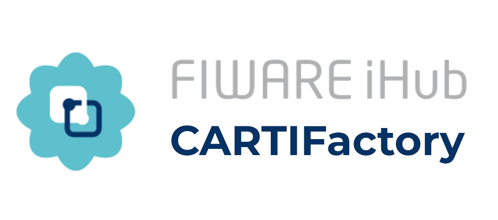
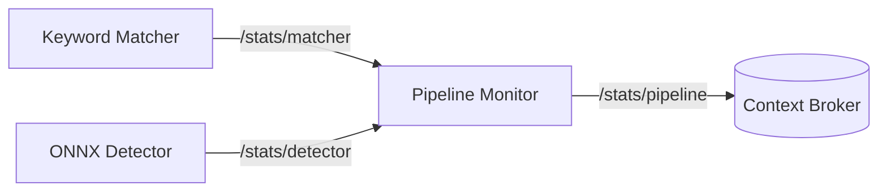

<p align="center">

  <!-- ---------- TOP IMAGE ---------- -->
  

</p>

<p align="center">
  <!-- ---------- ARISE logo ---------- -->
  <!-- Light mode -->
  

  <!-- Dark mode -->
  

  <!-- ---------- CARTIF logo ---------- -->
  

</p>

<p align="center">
  These 
  Modules are part of the ARISE Middleware<br>
  <a href="https://arise-middleware.eu/">ARISE Middleware site</a>
</p>

<hr>


[](https://github.com/eProsima/vulcanexus)
[](https://releases.ubuntu.com/24.04/)
[](https://github.com/FIWARE/context.Orion-LD/releases/tag/1.10.0)


# General Overview
[ARISE](https://arise-middleware.eu/) aims towards making industrial HRI more accessible and cost-effective, in particular in healthcare, intra-logistics and manufacturing sectors.

This is one of the reusable modules created to serve as an example on the ARISE Middleware.


## Features
- Automatic CPU / CUDA support
- Segmentation support (OBB from mask)
- Optional annotated image publishing
- Latched `class_map` publishing
- Industrial metrics (FPS, infer_ms, device, etc.)
- Configurable `class_id` mode

## Table of Contents


- [Getting Started](#getting-started)
  - [Dependencies](#dependencies)
- [What is Included in the Module](#what-is-included-in-the-module)
  - [Keyword Matcher](#keyword-matcher)
  - [ONNX Detector](#onnx-detector)
  - [Pipeline Monitor](#pipeline-monitor)
- [Custom Interfaces](#custom-interfaces)
  - [Pipeline Statistics](#pipeline-statistics)
  - [Detection Action](#detection-action)
- [Defining the Models](#defining-the-models)
- [Connecting to FIWARE's Context Broker](#connecting-to-fiwares-context-broker)
  - [Grafana Connection](#grafana-connection)
- [Running the Module](#running-the-module)

# Getting started
Start by cloning the repository

Then move to the workspace.
```bash
cd cartifactory_ws
```


## Dependencies

All Python dependencies are included inside the `requirements.txt` file. To install, execute on terminal:

```bash
pip install -r /requirements.txt
```

This package is dependent on other ROS2 interfaces:
``` bash
sudo apt install \
  ros-${ROS_DISTRO}-vision-msgs \
  ros-${ROS_DISTRO}-diagnostic-msgs \
  ros-${ROS_DISTRO}-cv-bridge
```

# What is included in the module
We provide the **CARTIFactory** package, home to several nodes, that together allow you to test this reusable module.

## Keyword Matcher


The keyword_matcher downstream of the detector node. Its main purpose is to determine whether a requested object class is present in the latest detections.

The node subscribes to the latest detection results and stores them internally. When a match request is received through the `custom_interfaces/MatchAction` action server, it compares the requested keyword against the detected class labels and returns only the detections that match that keyword. Matching can be configured to be case-insensitive, to stop at the first valid match, and to ignore detections below a configurable confidence threshold.

The node additionally monitors the availability of the camera stream by tracking incoming `CameraInfo` messages. If no camera information is received for a configurable timeout period, the node marks the camera as unavailable and rejects incoming match action goals. This allows the node to prevent match requests from being accepted when the perception pipeline is not receiving live input.

## ONNX Detector
The `detector_onnx` node performs image-based object detection and segmentation inference in ROS2 using an ONNX model executed with ONNX Runtime. It subscribes to a camera image topic, preprocesses each frame to the network input size, runs inference, post-processes the model outputs, and publishes the results as `vision_msgs/Detection2DArray`.

The node also supports optional publication of a debug image where masks, bounding boxes, labels, and oriented boxes are drawn on top of the original image. It publishes a latched class map topic so that downstream nodes can resolve class IDs to human-readable labels, either from a TOML configuration file or from fallback numeric IDs.

Configuration can be provided through ROS2 parameters and optionally complemented with a .toml file, which may define metadata such as model type, class names, default confidence threshold, and model path. The node supports execution on CPU or CUDA, depending on the selected device and available ONNX Runtime providers.

For monitoring and integration into production pipelines, the node can also publish pipeline statistics such as dropped frames and node identity. It includes an optional drop_if_busy mode to avoid queue buildup by discarding incoming frames when inference is still running on the previous one.

Overall, this node is designed as a ROS2 perception component for real-time industrial vision pipelines, combining ONNX inference, mask-based oriented detections, debug visualization, class mapping, and runtime statistics in a single detector node.

What does this node do:
- Subscribes to an RGB image topic
- Loads an ONNX detection/segmentation model
- Runs inference on each incoming frame, filtering detections by a confidence threshold.
- Converts segmentation masks into oriented bounding boxes and publishes detections as vision_msgs/Detection2DArray.
- Optionally publishes an annotated debug image and pipeline statistics.
- Supports CPU or CUDA execution with ONNX Runtime.

## Pipeline Monitor
This node is used for relaying different statistics of the workspace to the Context Broker (see the latest section about [FIWARE's Context Broker](#connecting-to-fiwares-context-broker)). 

This node subscribes to statistics topics being published by the other two nodes and publish it into a joined status message, using the interface `custom_interfaces/PipelineStats`.




# Custom Interfaces

A `custom_interfaces` package is included, to handle the custom message for the pipeline information and the goal


## Pipeline Statistics

For the sending the diagnostics to the Context Broker we use a custom interface `custom_interfaces/PipelineStats` with the followind definition:

| Field                    | Type              | Description                                                                             |
| ------------------------ | ----------------- | --------------------------------------------------------------------------------------- |
| `frames_dropped`         | `uint64`          | Number of frames discarded before processing due to overload or synchronization issues. |
| `action_goals_received`  | `uint64`          | Total number of goals received by the action server.                                    |
| `action_goals_accepted`  | `uint64`          | Number of goals accepted for execution.                                                 |
| `action_goals_rejected`  | `uint64`          | Number of goals rejected by the server.                                                 |
| `action_goals_canceled`  | `uint64`          | Number of goals canceled after acceptance.                                              |
| `action_goals_succeeded` | `uint64`          | Number of goals successfully completed.                                                 |
| `action_goals_failed`    | `uint64`          | Number of goals that finished with failure.                                             |
| `match_requests`         | `uint64`          | Total number of match operations requested.                                             |
| `match_success`          | `uint64`          | Number of successful match operations.                                                  |
| `match_fail`             | `uint64`          | Number of match operations that failed.                                                 |
| `fps_input`              | `float32`         | Frame rate of incoming images.                                                          |
| `fps_processed`          | `float32`         | Frame rate actually processed by the node.                                              |
| `avg_inference_ms`       | `float32`         | Average inference time per frame in milliseconds.                                       |
| `camera_available`       | `bool`            | Indicates whether the camera stream is currently available.                             |
| `node_name`              | `string`          | Name of the node publishing these metrics.                                              |


> [!WARNING]
> If infer_ms > 200 ms, a WARN status is published.


## Detection action
This action allows a client to request a visual search operation using a keyword.
The node performs detection and returns the results along with an annotated image.

### Goal
| Field | Type     | Description                                                        |
| ----- | -------- | ------------------------------------------------------------------ |
| `kw`  | `string` | Keyword describing the object or class to search for in the scene. |

### Result
| Field            | Type                           | Description                                                                 |
| ---------------- | ------------------------------ | --------------------------------------------------------------------------- |
| `action_success` | `bool`                         | Indicates whether the action execution completed successfully.              |
| `match_success`  | `bool`                         | Indicates whether a matching detection was found for the requested keyword. |
| `det`            | `vision_msgs/Detection2DArray` | Array containing the detections generated by the model.                     |
| `img`            | `sensor_msgs/Image`            | Image with the detections annotated for visualization or debugging.         |

### Feedback
| Field      | Type     | Description                                                                  |
| ---------- | -------- | ---------------------------------------------------------------------------- |
| `feedback` | `string` | Informational message describing the current status of the action execution. |

To call the action execute:
```bash
ros2 action send_goal /detection/match custom_interfaces/action/MatchAction "{kw: '<'your keyword'>}"
```

>[!TIP]
> If you want to also see the feedback from the action, add `--feedback` at the end.
> ```bash
> ros2 action send_goal /detection/match custom_interfaces/action/MatchAction "{kw: <'your keyword'>}" --feedback
> ```

# Defining the Models (TOML)
We are using [Tom's Obvious Minimal Language](https://toml.io/en/) for the configuration description of the models. The file follows this structure:
```bash
title = "Wheels"
description = "This model can detect wheels"
type = "Segmentation"

[model]
weights = "ruedasL-seg_v4.onnx"

[parameters]
confidence = 0.6

[classes]
classes=["Left","Right"]
colours = [[0, 0, 250], [250, 0, 0]]
```


# Connecting to FIWARE's Context Broker

The ecosystem the interaction is running under [Engineering Group's PoC](https://github.com/Engineering-Research-and-Development/arise-poc/) ecosystem. This is necessary for the Context Broker to be able to see the ROS2 topics. For this module, the IoT Agent OPCUA is not used, so its implementation is optional.

Database is PostGreSQL


## Grafana Connection


# Running the Module
The launch file `cartifactory_pipeline.launch.py` provides an easy way to start the module. You only need to define 
```bash
ros2 launch cartifactory cartifactory_pipeline.launch.py toml_path:=/path/to/model.toml
```


The following launch arguments configure the behavior of the ONNX detector node and its ROS2 interfaces.

## Launch Arguments

| Argument | Default | Type | Description |
|--------|--------|--------|--------|
| `toml_path` | `""` | string | Path to the `model.toml` configuration file used by the `onnx_detector` node. |
| `image_topic` | `/camera/camera/color/image_raw` | string | Input ROS2 image topic from which the detector subscribes to images. |
| `detections_topic` | `/detections` | string | Base topic where detection results are published. Annotated images are published on `<detections_topic>/image`. |
| `publish_debug_image` | `true` | bool | Enables publishing of the annotated debug image showing detections. |
| `detections_qos` | `sensor_data` | string | QoS profile used when publishing detection messages. |
| `debug_qos` | `best_effort` | string | QoS profile used when publishing the debug image topic. |
| `img_h` | `480` | int | Height of the image expected by the ONNX model. |
| `img_w` | `640` | int | Width of the image expected by the ONNX model. |
| `class_id_mode` | `name` | string | Determines how the detected class is published: `id` (numeric class id) or `name` (class label). |


> [!WARNING]
> TODO list:
>- [ ] Add `requirements.txt` file.
>- [ ] Revise TOML description - Delete unused.
>- [ ] Finalize FIWARE's Context Broker Description

---

This project has received funding from the European Union’s Horizon 2020 research and innovation programme under grant agreement no. 101135784.
<p align="left">
  <!-- ---------- ARISE logo ---------- -->
  <!-- Light mode -->
  

  <!-- Dark mode -->
  

</p>