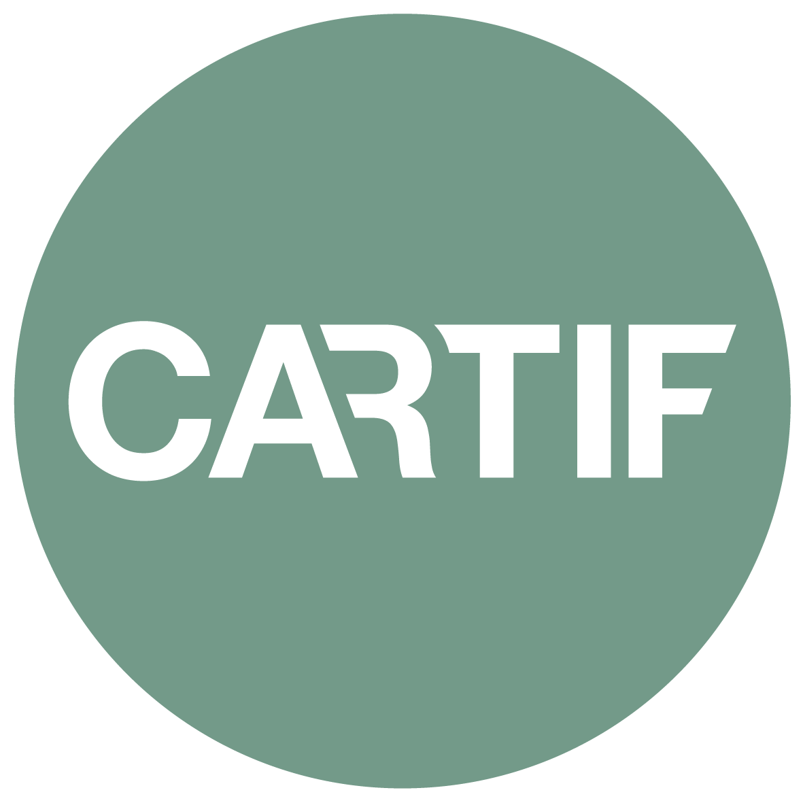

  <!-- ---------- iHUB logo ---------- -->
  

  <!-- ---------- CARTIF logo ---------- -->
  

# Welcome to CARTIFactory!

Link to our GitHub Pages: https://fundacion-cartif.github.io/CARTIFactory/

# ARISE MODULES
[ARISE](https://arise-middleware.eu/) aims towards making industrial HRI more accessible and cost-effective, in particular in healthcare, intra-logistics and manufacturing sectors. 
CARTIFactory provides the following reusable modules to serve as examples of implementations of the ARISE Middleware:
- [Matching between vision models and requests](https://github.com/Fundacion-CARTIF/cartifactory-vision-matching)
- [Operator tracking and gesture recognition](https://github.com/Fundacion-CARTIF/cartifactory-operator-tracking)

---
Funded by the European Union. Views and opinions expressed are however those of the author(s) only and do not necessarily reflect those of the European Union or HADEA. Neither the European Union nor the granting authority can be held responsible for them

  <!-- ---------- ARISE logo ---------- -->
  <!-- Light mode -->
  

  <!-- Dark mode -->
  

